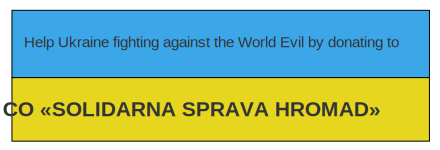

    

<!-- p align="left">
    

<table style="border-collapse: collapse; width: auto; margin: 0 auto font-size:16px">
  <tr>
    <td style="text-align: left; padding-right: 50px;">
        Person
    </td>
    <td style="text-align: left;">
        <b>Oleksandr <a href="https://github.com/MrCry0">Mr.Cryo</a> Suvorov</b>
    </td>
  </tr>
  <tr>
    <td style="text-align: left; padding-right: 50px;">
        Company
    </td>
    <td style="text-align: left;">
        <b><a href="https://github.com/quic">Qualcomm Innovation Center, Inc.</a></b>
    </td>
  </tr>
  <tr>
    <td style="text-align: left; padding-right: 50px;">
        Project
    </td>
    <td style="text-align: left;">
        <b><a href="https://github.com/foundriesio">Foundries.IO</a></b>
    </td>
  </tr>
  <tr>
    <td style="text-align: left; padding-right: 50px;">
        Position
    </td>
    <td style="text-align: left;">
        <b>Senior Staff Engineer</b>
    </td>
  </tr>
  <tr>
    <td style="text-align: left; padding-right: 50px;">
        Connect with me
    </td>
    <td style="text-align: left;">
        
        
        
        
        
        
        
    </td>
  </tr>
</table>

<!-- h3 align="left">Languages and Tools:</h3>

                      

    
    &nbsp;
    

    

